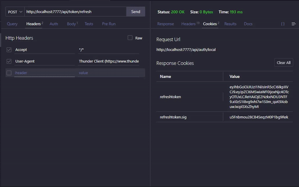
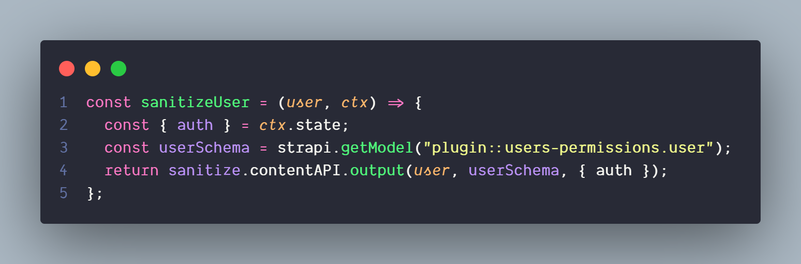
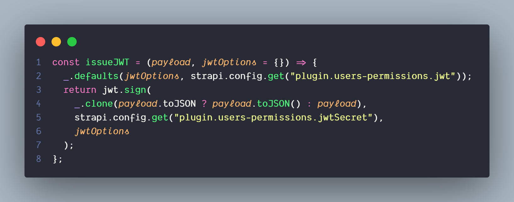
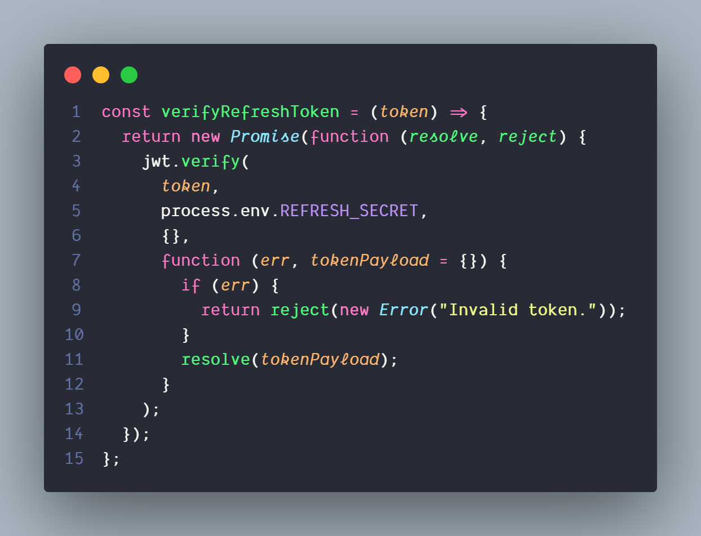
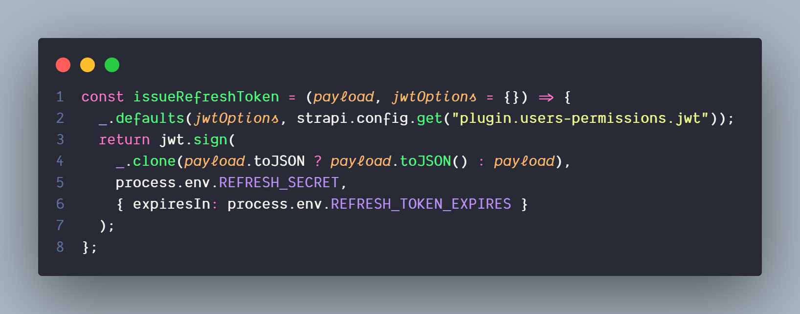

<h1>

    JWT Refresh Token for Strapi

</h1>

***

⚠ check `package.json` for strapi version

just drop `src` folder to your strapi root folder and chechah

###### Show Case

<h4>⚠Don't Foreget to include </h4>

###### 🔰 fetch API
##### `credentials: "include"`

###### 🔰 Axios 
##### `withCredentials: true `

###### 🔰 Other HTTP Client 
##### `Access-Control-Allow-Credentials: true`

## Code Simples

###### Sinitize User

###### Issue JWT

###### Verify Refresh Token

###### Issue Refresh Token

###### Add Refresh Endpoint to Strapi

